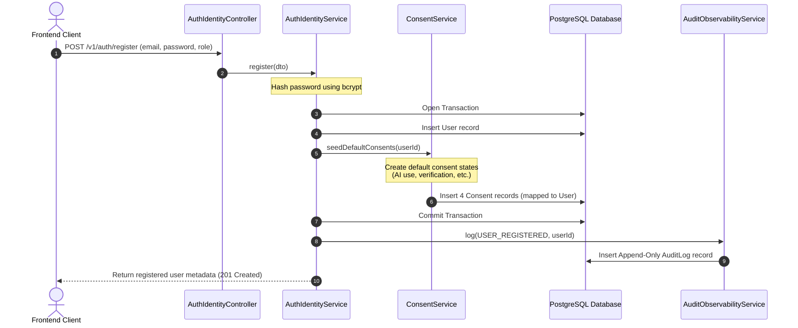
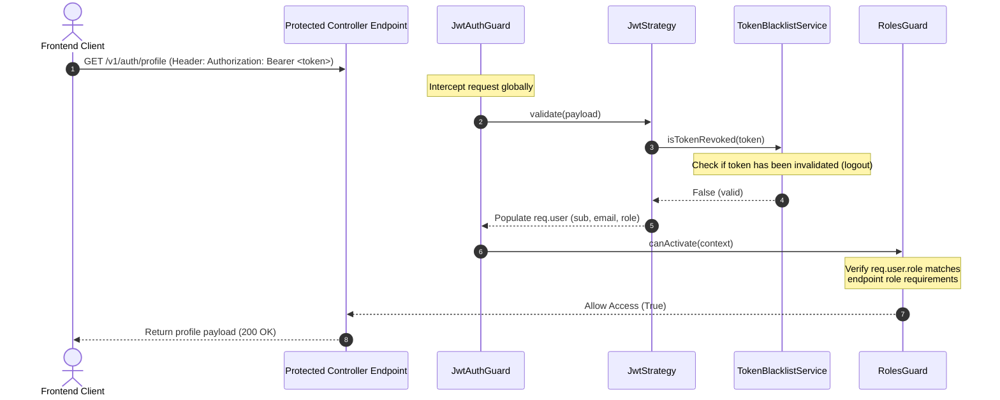
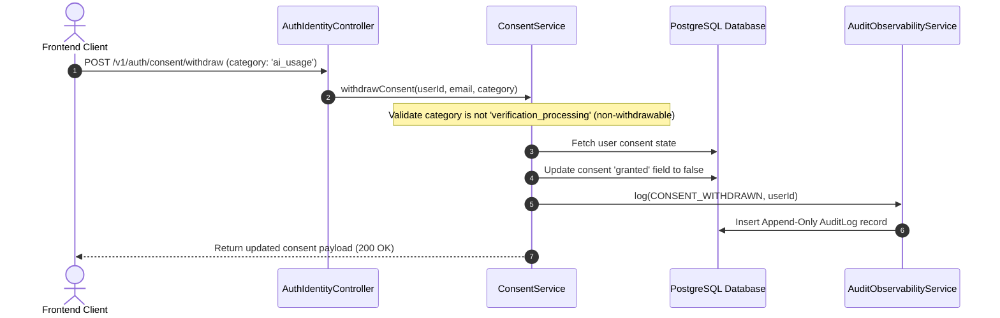

# Project Architecture & Request Flow

This document details the directory structure, modular boundaries, and request lifecycle flows for both the Frontend and Backend of the AI-Native Real Estate Platform.

---

## 📁 Directory Structure Overview

The project is structured as a mono-repository separating backend NestJS logic from frontend static assets:

```
AI-Native-Real-Estate-Platform/
├── Frontend/                    # Frontend presentation layer (static client)
│   ├── index.html               # Public landing page
│   ├── login.html               # User sign-in interface
│   ├── register.html            # User signup & role selection interface
│   ├── dashboard.html           # Secured role-specific dashboards
│   ├── css/                     # Styling stylesheet (style.css)
│   └── js/                      # Frontend routing and script logic (main.js)
├── src/                         # Backend business logic (NestJS Modular Monolith)
│   ├── main.ts                  # Bootstrap file (registers global guards, JSON logger)
│   ├── app.module.ts            # Root module (coordinates DB, Config, and feature modules)
│   ├── auth-identity/           # Bounded Context: Authentication, RBAC, and User Consent
│   │   ├── entities/            # Database schemas (User, Consent, RevokedToken)
│   │   ├── guards/              # Route interceptors (JwtAuthGuard, RolesGuard)
│   │   ├── strategies/          # Passport JWT strategy validation
│   │   └── *.service.ts         # User auth, token blacklist, and consent logic
│   └── audit-observability/     # Bounded Context: Append-only audit logs & Prometheus metrics
│       ├── entities/            # AuditLog database schema
│       └── *.controller.ts      # Log retrieval & prometheus exporter endpoints
└── docs/                        # Project status checklists and design verification reports
```

---

## 🧩 Backend Bounded Contexts

Following Domain-Driven Design (DDD) principles, the backend is partitioned into two isolated feature modules with strict boundaries:

```mermaid
graph TD
    AppModule[Root AppModule] --> AuthModule[Auth & Identity Module]
    AppModule --> AuditModule[Audit & Observability Module]
    
    subgraph AuthModule
        UserController[AuthIdentityController]
        AuthService[AuthIdentityService]
        ConsentService[ConsentService]
        UserEntity[(User Entity)]
        ConsentEntity[(Consent Entity)]
    end
    
    subgraph AuditModule
        AuditController[AuditObservabilityController]
        AuditService[AuditObservabilityService]
        MetricsController[MetricsController]
        AuditLogEntity[(AuditLog Entity)]
    end

    AuthService --> AuditService: Triggers Audit Events
```

---

## 🔄 Core Request Flows

Here is how core operations are processed across the system:

### 1. User Registration & Consent Seeding Flow

When a new user signs up, the system executes validation, user creation, and consent seeding atomically inside a database transaction:



---

### 2. User Login & Access Protection Flow

When a user logs in, they receive a JWT token which they must attach to all subsequent secure requests. The global guards process authentication and authorization checks:



---

### 3. Consent Modification Flow

Users can update optional consents. Crucial consent categories (e.g. Identity Verification) are marked as required and cannot be withdrawn:


